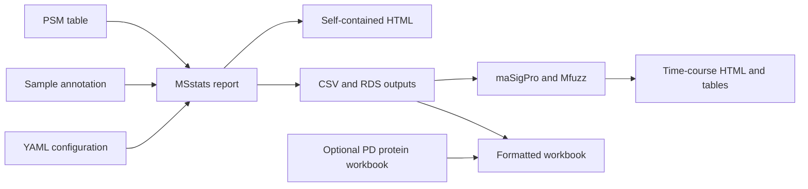

# PDtoMSstats

PDtoMSstats is a configuration-driven workflow that takes Proteome Discoverer
PSM data through quality control, MSstats protein summarization and planned
comparisons, optional formatted Excel export, and independent-sample
time-course analysis with maSigPro and Mfuzz.

Docker is the recommended way to run the workflow. The same image is used on
Linux, Windows, Intel macOS, and Apple Silicon macOS, so users do not need to
install R, Quarto, compilers, or individual R packages on the host computer.



## Quick start with Docker

Requirements:

- Docker Desktop on Windows or macOS, or Docker Engine with the Compose plugin
  on Linux;
- at least 8 GB RAM available to Docker; 12–16 GB is preferable for large
  studies.

Build the image and check the installed environment:

```bash
docker compose build
docker compose run --rm pdtomsstats
```

Run the bundled de-identified example from PSM input through time-course
analysis:

```bash
docker compose run --rm pdtomsstats \
  Rscript scripts/run_pipeline.R \
  config/example-data.yml \
  config/example-data-timecourse.yml
```

Outputs appear on the host under `results/example/` and figures under
`figures/example/`. The example contains synthetic identifiers and is intended
only to verify the software.

See [Docker instructions](docs/docker.md) and the
[example walkthrough](docs/example.md) for Windows, macOS, and Linux details.

## Analyze a new project

The main report needs:

1. a Proteome Discoverer PSM Excel, CSV, TSV, or tab-delimited TXT file;
2. a sample annotation Excel, CSV, TSV, or TXT file;
3. a YAML configuration copied from `config/example.yml`.

Private inputs can be placed under `data/<project>/`; all data are ignored by
Git except the bundled public example.

```bash
cp config/example.yml config/local-my-project.yml
```

Edit the file paths and design columns, then validate and render:

```bash
docker compose run --rm pdtomsstats \
  Rscript scripts/check_inputs.R config/local-my-project.yml

docker compose run --rm pdtomsstats \
  Rscript scripts/render_report.R config/local-my-project.yml
```

The annotation may contain extra rows. PDtoMSstats matches the PSM and
annotation tables by `File ID` and analyzes only the matching rows. A
`Condition` column can be supplied directly or constructed from any annotation
columns:

```yaml
condition_columns: ["Time", "Group"]
condition_template: "{Time}h_{Group}"
```

See [input files](docs/input-files.md) and the complete
[configuration reference](docs/configuration.md).

## Planned comparisons

Comparisons may be generated automatically, written directly in YAML, or read
from a long-format CSV/TSV/TXT design file. A row in the design file gives one
nonzero coefficient:

| ContrastType | Label | Condition | Weight |
|---|---|---|---:|
| pairwise | Treatment_vs_Reference | Treatment | 1 |
| pairwise | Treatment_vs_Reference | Reference | -1 |

The workflow validates zero-sum coefficients and produces a plain-language
contrast guide that is also added to the optional Excel export.

## Time-course analysis

The time-course report starts from the normalized protein-level RDS produced by
the main report. It is intended for independent biological samples, not
repeated measures. Configure the time and group columns and run:

```bash
docker compose run --rm pdtomsstats \
  Rscript scripts/render_timecourse_report.R \
  config/local-my-project-timecourse.yml
```

It performs balanced group-by-time coverage filtering, polynomial maSigPro
regression, explicit group-by-time interaction selection, and Mfuzz soft
clustering of the comparison-minus-reference effect trajectories. See the
[time-course guide](docs/timecourse.md).

## Optional formatted workbook

If the matching Proteome Discoverer hierarchical protein workbook is
available, run after the main report:

```bash
docker compose run --rm pdtomsstats \
  Rscript scripts/export_workbook.R \
  data/my-project/proteins.xlsx \
  results/my-project
```

The exporter uses only R packages, including `openxlsx2` when a Proteome
Discoverer workbook needs compatibility repair. Details are in the
[workbook export guide](docs/workbook-export.md).

## Native installation

Docker is not mandatory. A native installation needs R 4.5, Quarto 1.8, system
compilers, and all CRAN/Bioconductor dependencies:

```bash
Rscript scripts/install_dependencies.R
Rscript scripts/check_environment.R
```

Native OS-specific notes are in [installation.md](docs/installation.md).

## Repository layout

```text
.
├── Dockerfile
├── compose.yaml
├── msstats-psm-report.qmd
├── timecourse-masigpro-mfuzz.qmd
├── config/                 Configuration templates and public example configs
├── data/example/           Small de-identified runnable example
├── R/                      Reusable analysis helpers
├── scripts/                Validation, rendering, export, and setup tools
├── docs/                   User and method documentation
├── tests/                  Lightweight repository and example checks
├── results/                Generated outputs; ignored by Git
└── figures/                Generated figures; ignored by Git
```

## Reproducibility and privacy

- The container pins R 4.5.2, Bioconductor 3.21, and Quarto 1.8.26.
- Random operations use fixed seeds recorded in configuration files.
- Every report saves its parameters and R session information.
- Input data, local configuration files, results, figures, RDS files, and
  workbooks are ignored by Git by default.
- The public example is pseudonymized and explicitly unsuitable for biological
  inference.

## Citation and license

Citation metadata are provided in `CITATION.cff`. Scientific analyses should
also cite MSstats, maSigPro, Mfuzz, Quarto, and enrichment packages used in the
rendered report.

No distribution license has been selected yet. Replace `LICENSE` with the
owner-approved license before publishing the repository publicly.
