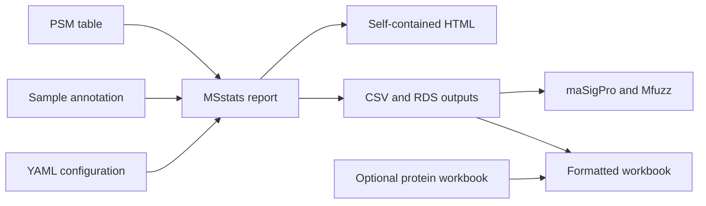

::: {.hero}
::: {.hero-kicker}
PORTABLE PROTEOMICS ANALYSIS
:::

# From Proteome Discoverer data to reproducible MSstats results.

PDtoMSstats turns PSM and sample annotation files into quality-control reports,
protein summaries, planned comparisons, pathway results, and polished Excel
workbooks. Routine use does not require R programming.

[Get started with Docker](getting-started.md){.btn .btn-primary .btn-lg}
[Run on an HPC](hpc-singularity.md){.btn .btn-outline-primary .btn-lg}
:::

::: {.home-section}
## One workflow, several ways to run it

Docker is the recommended environment for Windows, macOS, and Linux.
SingularityCE and Apptainer are supported on HPC systems. Routine use does not
require R programming.

::: {.guide-grid}
::: {.guide-card}
#### First-time user

Start with [Getting started without R programming](getting-started.md). It
walks through installing Docker, running the de-identified example, adding
project files, editing the configuration, and finding the outputs.

[Open the step-by-step guide →](getting-started.md)
:::

::: {.guide-card}
#### HPC user

Use the [SingularityCE and Apptainer guide](hpc-singularity.md) for interactive
compute nodes and Slurm jobs.

[See interactive and Slurm examples →](hpc-singularity.md)
:::

::: {.guide-card .guide-card-accent}
#### Ready to configure a study

Review the expected [input files](input-files.md), then copy the supplied YAML
template and use the [configuration reference](configuration.md) to describe
the study design.

[Prepare a project →](input-files.md)
:::
:::
:::

::: {.home-section}
## A transparent path from input to results

::: {.workflow-panel}

:::
:::

::: {.home-section}
## A simple working sequence

::: {.principle-row}
::: {.principle-step}
1

**Prepare**

Add the PSM table, sample annotation, and optional contrast file.
:::

::: {.principle-step}
2

**Configure**

Set file paths and design columns in a short, readable YAML file.
:::

::: {.principle-step}
3

**Validate**

Check file names, column names, sample matching, and study labels before analysis.
:::

::: {.principle-step}
4

**Analyze**

Run the same versioned environment on a laptop, workstation, or HPC system.
:::
:::
:::

::: {.home-section}
## What the workflow provides

::: {.feature-grid}
::: {.feature-item}
#### MSstats analysis

Quality control, protein summarization, planned contrasts, and pathway analysis
with explicit saved settings and results.

[Review the example →](example.md)
:::

::: {.feature-item}
#### Publication-ready workbook

Protein and peptide views, contrast explanations, consistent formatting, and
full-width visual grouping of collapsed rows.

[See workbook outputs →](workbook-export.md)
:::

::: {.feature-item}
#### Optional time course

Independent-sample temporal analysis with maSigPro and Mfuzz when a compatible
time-course configuration is supplied.

[Understand the time-course stage →](timecourse.md)
:::
:::
:::

::: {.home-section .final-cta}
## Start with the de-identified example

Use the bundled synthetic data to confirm the complete environment before
adding private project files.

[Run the example](example.md){.btn .btn-primary}
[View the source on GitHub](https://github.com/OpenOmics/PDtoMSstats){.btn .btn-outline-primary}
:::
