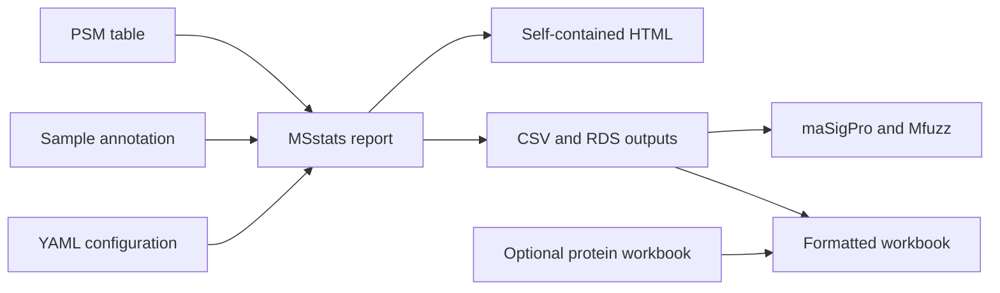

PDtoMSstats is a configuration-driven workflow for quality control, MSstats
protein summarization and planned comparisons, pathway analysis, formatted
Excel export, and optional independent-sample time-course analysis with
maSigPro and Mfuzz.

Docker is the recommended environment for Windows, macOS, and Linux.
SingularityCE and Apptainer are supported on HPC systems. Routine use does not
require R programming.

## Choose a starting point

::: {.callout-tip}
## First-time user

Start with [Getting started without R programming](getting-started.md). It
walks through installing Docker, running the de-identified example, adding
project files, editing the configuration, and finding the outputs.
:::

::: {.callout-note}
## HPC user

Use the [SingularityCE and Apptainer guide](hpc-singularity.md) for interactive
compute nodes and Slurm jobs.
:::

## Workflow

## Documentation

- [Input file requirements](input-files.md)
- [Configuration reference](configuration.md)
- [Docker guide](docker.md)
- [SingularityCE and Apptainer HPC guide](hpc-singularity.md)
- [De-identified example](example.md)
- [Formatted workbook export](workbook-export.md)
- [Time-course analysis](timecourse.md)
- [Native installation](installation.md)
- [Maintainer publishing guide](publishing.md)

The source code and issue tracker are hosted in the
[OpenOmics/PDtoMSstats GitHub repository](https://github.com/OpenOmics/PDtoMSstats).
